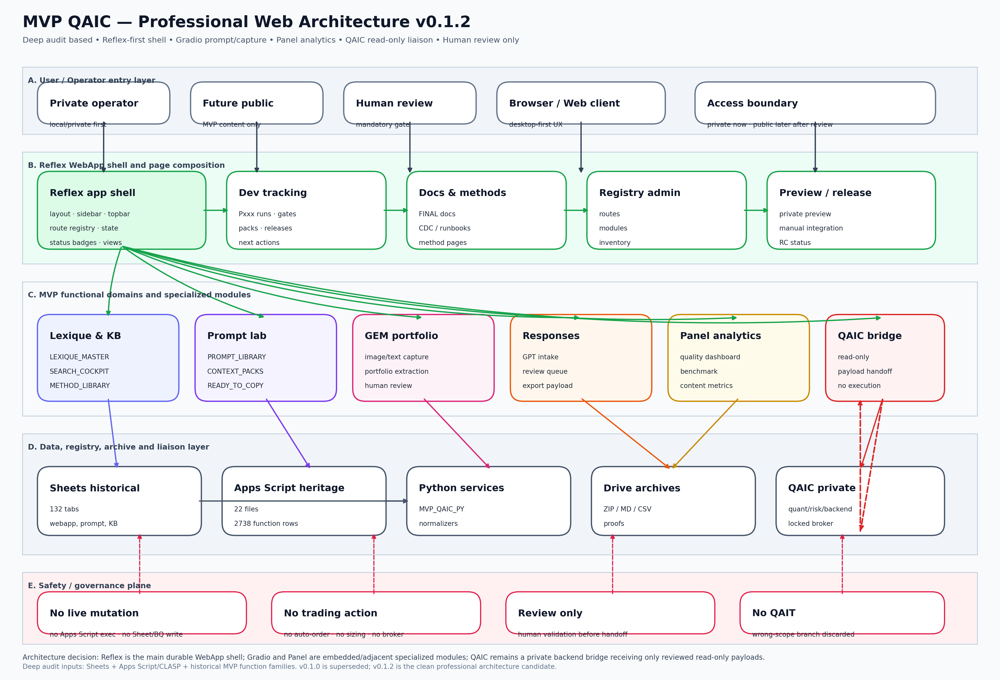

# 🧱 CDC Architecture WebApp — MVP QAIC + Liaison QAIC

**Version :** `MVP_QAIC_WEBAPP_ARCHITECTURE_CDC_0.1.2_PRO_WEB_ARCHITECTURE`  
**Date :** `2026-06-25`  
**Statut :** `PRO_ARCHITECTURE_CANDIDATE_READY_FOR_MVP_INJECTION`  
**Périmètre :** `MVP QAIC WebApp / Prompt / Lexique / Docs / QAIC liaison`  
**Mode permanent :** `HUMAN_REVIEW_ONLY`  
**Garde-fous :** `NO_AUTO_ORDER` — `NO_AUTO_SIZING` — `NO_BROKER_EXECUTION` — `NO_REAL_ORDER`  
**Remplace :** `v0.1.1`  
**À fusionner plus tard avec QAIC :** `PENDING_QAIC_CDC_BRIDGE_FREEZE`

---

## 0. Décision de version

Cette version `v0.1.2` remplace la `v0.1.1` parce que le schéma devait être davantage orienté architecture Web professionnelle.

```text
CDC_v0_1_0=SUPERSEDED_NOT_SEALED
CDC_v0_1_1=SUPERSEDED_BY_PRO_WEB_ARCHITECTURE
CDC_v0_1_2=ACTIVE_CANDIDATE
SCOPE=MVP_QAIC_ONLY
QAIT_BRANCH=DISCARDED
QAIC_BRIDGE_FUSION=WAIT_QAIC_CDC_FREEZE
```

---

## 1. Objectif

Définir une architecture WebApp MVP QAIC durable, construite à partir de l’audit profond Sheets + Apps Script + fonctions, et prête à évoluer progressivement avec la future contribution QAIC sur les passerelles.

La WebApp doit couvrir :

- administration WebApp / docs / méthodes ;
- lexique et knowledge base ;
- prompt lab ;
- GEM portfolio capture ;
- response review ;
- dev tracking online ;
- registry / architecture map ;
- liaison QAIC read-only ;
- audit et archives.

---

## 2. Audit profond intégré

```text
SHEET_TABS_OBSERVED=132
SHEET_VISIBLE_ESTIMATE=74
SHEET_HIDDEN_ESTIMATE=58
APPS_SCRIPT_FILES=22
FUNCTION_ROWS=2738
UNIQUE_FUNCTIONS=2674
PUBLIC_FUNCTIONS=1990
INTERNAL_FUNCTIONS=748
SCRIPTS_WRITE_SHEET_LIKELY=16
SCRIPTS_DELETE_OR_CLEAR_RISK=14
```

Scripts structurants à considérer dans la migration WebApp :

| script_file_name                                       | module_family    |   total_function_count |   public_function_count |   internal_function_count |   risk_hit_count |
|:-------------------------------------------------------|:-----------------|-----------------------:|------------------------:|--------------------------:|-----------------:|
| mvpqaic_23_gpt_response_intake_core.js                 | QAIC_BRIDGE      |                    867 |                     765 |                       102 |              149 |
| mvpqaic_11_p1_prompt_quality_core.js                   | PROMPT_ENGINE    |                    747 |                     402 |                       345 |              109 |
| mvpqaic_50_p5_webapp_readiness_core.js                 | QAIC_BRIDGE      |                    387 |                     374 |                        13 |               78 |
| mvpqaic_31_lexique_master_search_cockpit_core.js       | KNOWLEDGE_SEARCH |                    198 |                      71 |                       127 |               26 |
| mvpqaic_41_phase4_closure_cdc_tracker_core.js          | QAIC_BRIDGE      |                    186 |                     131 |                        55 |               29 |
| mvpqaic_09_p1_journal_core.js                          | JOURNAL          |                     75 |                      75 |                         0 |                7 |
| mvpqaic_20_script_registry_maintenance_core.js         | SCRIPT_REGISTRY  |                     45 |                      10 |                        35 |               23 |
| mvpqaic_21_sheet_inventory_cross_audit_core.js         | AUDIT_INVENTORY  |                     37 |                       6 |                        31 |                3 |
| mvpqaic_91_webapp_sheets_sync.js                       | QAIC_BRIDGE      |                     35 |                       6 |                        29 |                0 |
| mvpqaic_06_p0b4_gpt_revolutx_bridge.js                 | QAIC_BRIDGE      |                     30 |                      30 |                         0 |               10 |
| mvpqaic_42_response_intake_consolidation_audit_core.js | AUDIT_INVENTORY  |                     26 |                      25 |                         1 |                3 |
| mvpqaic_07_p0b5_trade_plan_methods_trailing.js         | QAIC_BRIDGE      |                     21 |                      21 |                         0 |                8 |

---

## 3. Schéma d’architecture Web professionnel

### PNG



### SVG source

`CDC_MVP_QAIC_WEBAPP_ARCHITECTURE_SCHEMA_PRO_v0_1_2.svg`

Le schéma est organisé en cinq couches :

1. **User / Operator entry layer** : opérateur privé, futur public, human review, browser, access boundary.
2. **Reflex WebApp shell** : layout, sidebar, topbar, route registry, dev tracking, docs, registry admin, preview/release.
3. **MVP functional domains** : Lexique & KB, Prompt Lab, GEM Portfolio, Responses, Panel Analytics, QAIC Bridge.
4. **Data / registry / archive / liaison** : Sheets historical, Apps Script heritage, Python services, Drive archives, QAIC private.
5. **Safety / governance plane** : no live mutation, no trading action, review only, no QAIT.

---

## 4. Architecture cible

```text
Browser / operator
→ Reflex shell
→ domain pages
→ specialized modules
→ reviewed payloads
→ QAIC readonly liaison
```

### 4.1 Reflex

Reflex devient le shell principal :

```text
REFLEX_ROLE=MAIN_WEBAPP_SHELL
RESPONSIBILITIES=layout,routing,state,dev_tracking,docs,registry,preview,safety
```

### 4.2 Gradio

Gradio reste spécialisé :

```text
GRADIO_ROLE=PROMPT_IMAGE_GEM_MODULE
RESPONSIBILITIES=image_upload,prompt_lab,GEM_portfolio,response_review
```

### 4.3 Panel

Panel reste spécialisé :

```text
PANEL_ROLE=ANALYTICS_BENCHMARK_MODULE
RESPONSIBILITIES=quality_dashboard,benchmark,content_metrics,QAIC_readonly_analytics_later
```

### 4.4 QAIC

QAIC reste privé :

```text
QAIC_ROLE=PRIVATE_BACKEND
MVP_TO_QAIC=READONLY_REVIEWED_PAYLOADS_ONLY
BROKER_IN_MVP=false
ORDER_IN_MVP=false
SIZING_IN_MVP=false
```

---

## 5. Menu WebApp cible

```text
01 Dashboard
02 Dev Tracking
03 Lexique & Knowledge
04 Prompt Lab
05 GEM Portfolio
06 Responses Review
07 Documents & Methods
08 Architecture & Registry
09 QAIC Bridge
10 Settings & Safety
11 Audit & Archives
```

Chaque route doit exposer :

```text
route_id
route_path
menu_label
status
source_family
payload_contract
human_review_required
no_live_action
```

---

## 6. Flux de données

### 6.1 Flux MVP interne

```text
Sheets / Apps Script heritage
→ Python migration services
→ Reflex admin pages
→ Gradio / Panel where relevant
→ reviewed local payloads
→ archives / audit
```

### 6.2 Flux QAIC

```text
MVP reviewed payload
→ QAIC Bridge contract
→ QAIC private backend
→ no broker action from MVP
```

---

## 7. Règles permanentes

```text
HUMAN_REVIEW_ONLY=true
NO_AUTO_ORDER=true
NO_AUTO_SIZING=true
NO_BROKER_EXECUTION=true
NO_REAL_ORDER=true
NO_APPS_SCRIPT_EXECUTION=true
NO_CLASP_PUSH=true
NO_SHEET_WRITE=true
NO_BIGQUERY_WRITE=true
NO_PUBLIC_PUBLISH=true
NO_QAIT=true
```

---

## 8. Rangement documentaire

Les fichiers de cette version doivent être rangés dans :

```text
MVP_QAIC_PY/docs/FINAL/WEBAPP_ARCHITECTURE_CDC/
```

Structure recommandée :

```text
WEBAPP_ARCHITECTURE_CDC/
  README.md
  CURRENT/
    CDC_MVP_QAIC_WEBAPP_ARCHITECTURE_QAIC_LIAISON_v0_1_2.md
    CDC_MVP_QAIC_WEBAPP_ARCHITECTURE_SCHEMA_PRO_v0_1_2.png
    CDC_MVP_QAIC_WEBAPP_ARCHITECTURE_SCHEMA_PRO_v0_1_2.svg
    CDC_MVP_QAIC_WEBAPP_ARCHITECTURE_VERIFY_v0_1_2.json
  ARCHIVE/
    v0_1_0/
    v0_1_1/
```

---

## 9. Future fusion QAIC

Quand QAIC aura figé son CDC passerelles, créer une version :

```text
MVP_QAIC_WEBAPP_ARCHITECTURE_CDC_0.2.0_QAIC_BRIDGE_FUSED
```

À intégrer :

```text
QAIC_CDC_BRIDGE_CONTRACTS
QAIC_PAYLOAD_SCHEMA
QAIC_READONLY_IMPORT_POLICY
QAIC_PRIVATE_BACKEND_BOUNDARY
QAIC_NO_EXECUTION_FROM_MVP_RULES
```

---

## 10. Décision finale

```text
CDC_MVP_QAIC_WEBAPP_ARCHITECTURE_QAIC_LIAISON_v0_1_2=ACTIVE_CANDIDATE
COMPLEX_PRO_SCHEMA_INCLUDED=true
SCOPE=MVP_QAIC_ONLY
REFLEX=MAIN_WEBAPP_SHELL
GRADIO=PROMPT_IMAGE_GEM_MODULE
PANEL=ANALYTICS_BENCHMARK_MODULE
QAIC_LINK=READONLY_REVIEWED_PAYLOADS_ONLY
NEXT=P219E3_OR_P_REFLEX_01_MVP_DEV_TRACKING_ONLINE_POC
```
